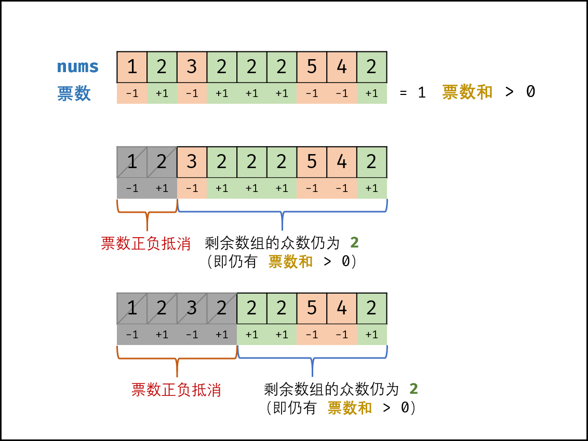

| [English](README_EN.md) | 简体中文 |

# [169. 多数元素](https://leetcode-cn.com/problems/majority-element)
<p>给定一个大小为 <em>n </em>的数组，找到其中的多数元素。多数元素是指在数组中出现次数<strong>大于</strong>&nbsp;<code>&lfloor; n/2 &rfloor;</code>&nbsp;的元素。</p>

<p>你可以假设数组是非空的，并且给定的数组总是存在多数元素。</p>

<p>&nbsp;</p>

<p><strong>示例&nbsp;1:</strong></p>

<pre><strong>输入:</strong> [3,2,3]
<strong>输出:</strong> 3</pre>

<p><strong>示例&nbsp;2:</strong></p>

<pre><strong>输入:</strong> [2,2,1,1,1,2,2]
<strong>输出:</strong> 2
</pre>

**标签:**  [位运算](https://leetcode-cn.com/tag/bit-manipulation) [数组](https://leetcode-cn.com/tag/array) [分治算法](https://leetcode-cn.com/tag/divide-and-conquer) 
 ### 相似题目
- 中等:	[求众数 II](https://leetcode-cn.com/problems/majority-element-ii) 
- 简单:	[检查一个数是否在数组中占绝大多数](https://leetcode-cn.com/problems/check-if-a-number-is-majority-element-in-a-sorted-array) 

# 解题思路 √

### Python

1. 直接利用多数元素操作 - **数组中点的元素**

```python
class Solution:
    def majorityElement(self, nums: List[int]) -> int:
        length=len(nums)
        nums=sorted(nums)
        return nums[length//2]
```

2. **摩尔投票法**

   - 票数和：由于众数出现的次数超过数组长度的一半
     - 所以 **众数** 票数+1， **非众数** 的票数 -1，最后所有的票数和也一定是 **正** 的

   - **票数正负抵消：**
     - 如果前面 a 个数字的 **票数和 = 0**，那么后面的 **n-a** 个数字的票数和一定也大于0
     - 即后面 **n-a** 个数字的众数仍然是我们要的那个数 x

   

   **算法原理：**

   假设数组首元素 `a` 为众数，遍历统计票数，如果发生正负抵消的时候， **剩余数组的众数一定不会改变**

   - 当 a == x 的时候，抵消的所有数字中，有一半是真正的众数 x
   - 当 a != x 的时候，抵消的所有数字中，少于或者等于一半是众数 x

   每轮都可以 **缩小剩余数组的区间** 。当遍历完成时，最后一轮假设的数字就是众数。

   **算法流程: **

   1. 初始化： 票数统计 votes = 0， 众数 x；

   2. 循环抵消： 遍历数组 nums 中的每个数字 num ；
      - 当 票数 votes等于 0 ，则假设 当前数字 num 为 众数 x ；
      - 当 num = x 时，票数 votes 自增 11 ；否则，票数 votes 自减 11 。

   3. 返回值： 返回 众数 x 即可


```python
class Solution:
    def majorityElement(self, nums: List[int]) -> int:
        votes=0
        for num in nums:
            if votes==0:x=num
            votes+=1 if num==x else -1
        return x
```

**补充** - 对于本题已经明确说了众数存在所以不用额外的验证，如果考虑，需要增加验证环节：、

```python
class Solution:
    def majorityElement(self, nums: List[int]) -> int:
        votes,count=0,0
        for num in nums:
            if votes==0:x=num
            votes+=1 if num==x else -1
        
        for num in nums:
            if num==x:count+=1
        return x if count>len(nums)//2 else 0
```


### C++

```cpp

```

---


# 整理与总结

1. 