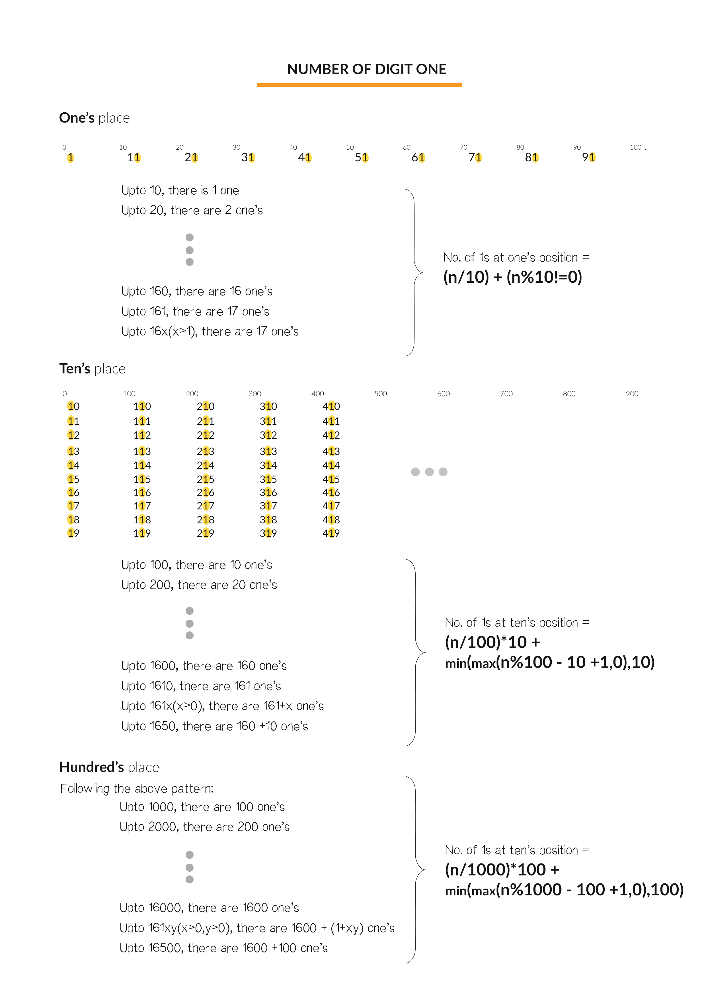

| [English](README_EN.md) | 简体中文 |

# [233. 数字 1 的个数](https://leetcode-cn.com/problems/number-of-digit-one)
<p>给定一个整数 n，计算所有小于等于 n 的非负整数中数字 1 出现的个数。</p>

<p><strong>示例:</strong></p>

<pre><strong>输入:</strong> 13
<strong>输出:</strong> 6 
<strong>解释: </strong>数字 1 出现在以下数字中: 1, 10, 11, 12, 13 。</pre>

**标签:**  [数学](https://leetcode-cn.com/tag/math) 
 ### 相似题目
- 简单:	[阶乘后的零](https://leetcode-cn.com/problems/factorial-trailing-zeroes) 
- 困难:	[范围内的数字计数](https://leetcode-cn.com/problems/digit-count-in-range) 

# 解题思路 √

### Python

1. 数学方法
   $$
   min(max((n mod (i*10))−i+1,0),i)
   $$
   



**详细分析：**

- 首先明确原则：按位计算
- 每一位分为两个部分：整除得到的 + 取模（超出规整部分的
- 取模部分：`min(max(n % divider - i + 1, 0), i)`
  - `n % divider` 很好理解
  - 拆分一下比较好理解（举例 i=10, divider=100)
    - 取完模剩下的是 超出整百的部分：0 - 99
    - 对于 0 - 9：在 **十位** 上面没有贡献
    - 对于 10 - 19：每一个都有贡献，并且最多是 **10(i)** 个额外的 1
    - 对于 20 - 99：没啥用了
  - 其实这个公式更像是从现象中总结的，或者要是理解的话是
    -  **(max - 非负)差值作为计数** 和 **当前 i 所允许的值 (i)**
    - 之前取 **（min）最小值** 来作为这部分的结果

```python
class Solution:
    def countDigitOne(self, n: int) -> int:
        count, i = 0, 1
        while i <= n:
            divider = i * 10
            count += (n // divider) * i + min(max(n % divider - i + 1, 0), i)
            i = divider
```


```python

```

### C++

```cpp

```

---


# 整理与总结

1. 